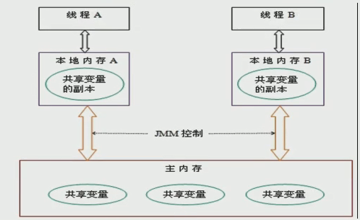
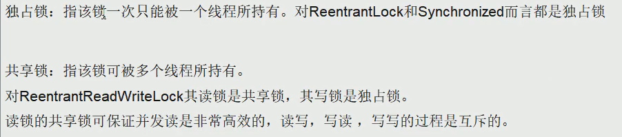
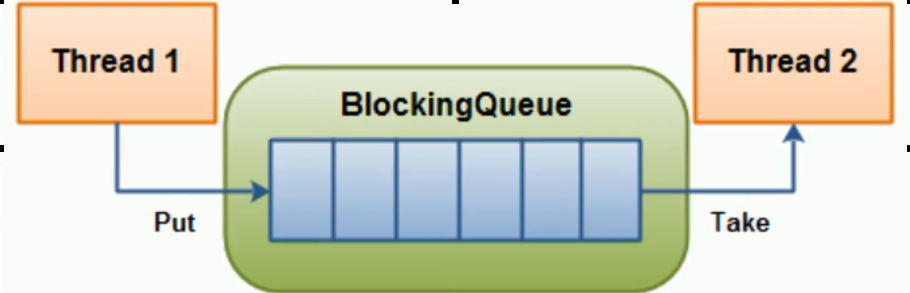
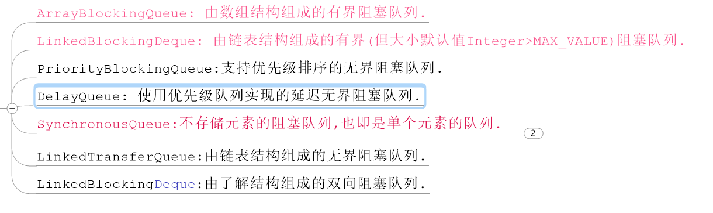
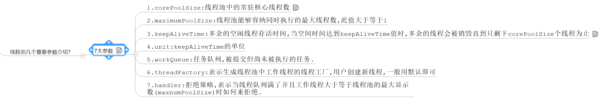
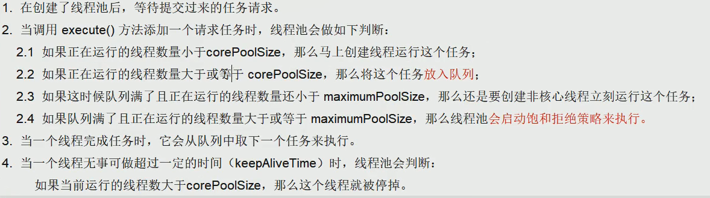
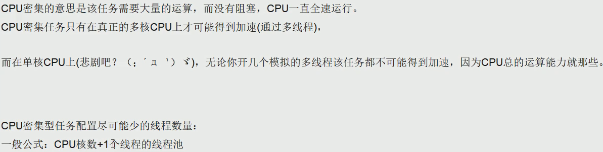
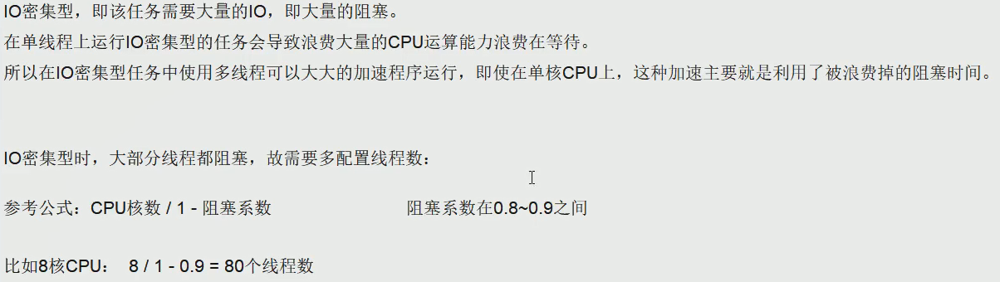
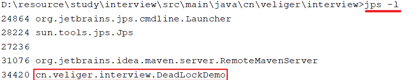
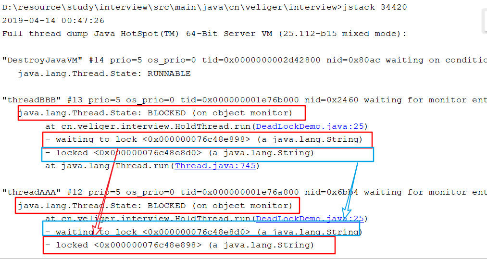

# 面试题

[toc]

<!-- GFM-TOC -->

<!-- GFM-TOC -->

## Volatile

volatile是Java虚拟机提供的轻量级的同步机制

+ 保证可见性

  通过前面对JMM的介绍,我们知道
  各个线程对主内存中共享变量的操作都是各个线程各自拷贝到自己的工作内存操作后再写回主内存中的.
  这就可能存在一个线程AAA修改了共享变量X的值还未写回主内存中时 ,另外一个线程BBB又对内存中的一个共享变量X进行操作,但此时A线程工作内存中的共享比那里X对线程B来说并不不可见.这种工作内存与主内存同步延迟现象就造成了可见性问题.

  ```java
  package com.ntuzy.recruit;
  
  import java.util.concurrent.TimeUnit;
  
  /**
   * @Author IamZY
   * @create 2020/1/14 17:08
   */
  
  class MyData {
      volatile int number = 0;
  
      public void addTo60() {
          number = 60;
      }
  }
  
  /**
   * 验证volatile
   */
  public class VolatileDemo {
  
      public static void main(String[] args) {  // main是一切方法的云翔入口
  
          MyData myData = new MyData();
  
          new Thread(() -> {
              System.out.println(Thread.currentThread().getName() + " come in ... ");
              try {
                  TimeUnit.SECONDS.sleep(3);
              } catch (InterruptedException e) {
                  e.printStackTrace();
              }
              myData.addTo60();
              System.out.println(Thread.currentThread().getName() + " update the number " + myData.number);
          }, "AAA").start();
  
          while (myData.number == 0) {
  
          }
  
          System.out.println(Thread.currentThread().getName() + " mission is over");
  
  
      }
  
  }
  
  ```

  

+ **不保证原子性**

  完整性、不可分割性、也即某个县城正在做某个具体业务时，中间不可以被加塞或者被分割。需要整体完整/要么同时成功，要么同时失败。

  ```java
  package com.ntuzy.recruit;
  
  import java.util.concurrent.TimeUnit;
  import java.util.concurrent.atomic.AtomicInteger;
  
  /**
   * @Author IamZY
   * @create 2020/1/14 17:08
   */
  
  class MyData {
      volatile int number = 0;
  
      public void addTo60() {
          number = 60;
      }
  
  //    public /*synchronized*/ void addPP() {
  
      public synchronized void addPP() {
          number++;
      }
  
      AtomicInteger atomicInteger = new AtomicInteger(0);
  
      public void add() {
          // i++
          atomicInteger.getAndIncrement();
      }
  
  
  }
  
  /**
   * 验证volatile
   */
  public class VolatileDemo {
  
      public void seeOkByVolatile() {
          MyData myData = new MyData();
  
          new Thread(() -> {
              System.out.println(Thread.currentThread().getName() + " come in ... ");
              try {
                  TimeUnit.SECONDS.sleep(3);
              } catch (InterruptedException e) {
                  e.printStackTrace();
              }
              myData.addTo60();
              System.out.println(Thread.currentThread().getName() + " update the number " + myData.number);
          }, "AAA").start();
  
          while (myData.number == 0) {
  
          }
  
          System.out.println(Thread.currentThread().getName() + " mission is over");
      }
  
  
      public static void main(String[] args) {  // main是一切方法的云翔入口
  
  
          MyData myData = new MyData();
  
          for (int i = 0; i < 20; i++) {
              new Thread(() -> {
                  for (int j = 0; j < 1000; j++) {
  //                    myData.addPP();
                      myData.add();
                  }
              }, "" + i).start();
          }
  
          // main + gc线程
          while (Thread.activeCount() > 2) {
              Thread.yield();
          }
  
          System.out.println(myData.atomicInteger);
  
      }
  
  }
  
  ```

  

+ 禁止指令重排

  计算机在执行程序时,为了提高性能,编译器和处理器常常会做指令重排,一把分为以下3中

  

  单线程环境里面确保程序最终执行结果和代码顺序执行的结果一致.
  处理器在进行重新排序是必须要考虑指令之间的数据依赖性

  多线程环境中线程交替执行,由于编译器优化重排的存在,两个线程使用的变量能否保持一致性是无法确定的,结果无法预测

  

  

## JMM

JMM(Java内存模型Java Memory Model,简称JMM)本身是一种抽象的概念 并不真实存在,它描述的是一组规则或规范通过规范定制了程序中各个变量(包括实例字段,静态字段和构成数组对象的元素)的访问方式.
JMM关于同步规定:

+ 线程解锁前,必须把共享变量的值刷新回主内存
+ 线程加锁前,必须读取主内存的最新值到自己的工作内存
+ 加锁解锁是同一把锁

由于JVM运行程序的实体是线程,而每个线程创建时JVM都会为其创建一个工作内存(有些地方成为栈空间),工作内存是每个线程的私有数据区域,而Java内存模型中规定所有变量都存储在主内存,主内存是共享内存区域,所有线程都可访问,但线程对变量的操作(读取赋值等)必须在工作内存中进行,首先要将变量从主内存拷贝到自己的工作空间,然后对变量进行操作,操作完成再将变量写回主内存,不能直接操作主内存中的变量,各个线程中的工作内存储存着主内存中的变量副本拷贝,因此不同的线程无法访问对方的工作内存,此案成间的通讯(传值) 必须通过主内存来完成,其简要访问过程如下图:



## CAS

CAS的全称为Compare-And-Swap ,它是一条CPU并发原语.
它的功能是判断内存某个位置的值是否为预期值,如果是则更新为新的值,这个过程是原子的.

CAS并发原语提现在Java语言中就是sun.miscUnSaffe类中的各个方法.调用UnSafe类中的CAS方法,JVM会帮我实现CAS汇编指令.这是一种完全依赖于硬件 功能,通过它实现了原子操作,再次强调,由于CAS是一种系统原语,原语属于操作系统用于范畴,是由若干条指令组成,用于完成某个功能的一个过程,并且原语的执行必须是连续的,在执行过程中不允许中断,也即是说CAS是一条原子指令,不会造成所谓的数据不一致的问题.

### UnSafe

+ 是CAS的核心类 由于Java 方法无法直接访问底层 ,需要通过本地(native)方法来访问,UnSafe相当于一个后面,基于该类可以直接操作特额定的内存数据.UnSafe类在于sun.misc包中,其内部方法操作可以向C的指针一样直接操作内存,因为Java中CAS操作的助兴依赖于UNSafe类的方法.
  注意UnSafe类中所有的方法都是native修饰的,也就是说UnSafe类中的方法都是直接调用操作底层资源执行响应的任务
+ 变量ValueOffset,便是该变量在内存中的偏移地址,因为UnSafe就是根据内存偏移地址获取数据的
+ 变量value和volatile修饰,保证了多线程之间的可见性.

### ABA问题


## ArrayList、Set、Map

## 公平锁与非公平锁

## 可重入锁

线程可以进入任何一个它已经拥有锁的同步的代码块

避免死锁

## 自旋锁

尝试获取锁的线程不会立即阻塞，而是采用循环的方式尝试获取锁

## 独占锁、共享锁、互斥锁



## 读写锁

## CountDownLatch

CountDownLatch主要有两个方法,当一个或多个线程调用await方法时,调用线程会被阻塞.其他线程调用countDown方法计数器减1(调用countDown方法时线程不会阻塞),当计数器的值变为0,因调用await方法被阻塞的线程会被唤醒,继续执行

```java
package com.ntuzy.recruit;


import java.security.PrivateKey;
import java.util.concurrent.CountDownLatch;

/**
 * @Author IamZY
 * @create 2020/1/28 14:39
 */
enum CountryEnum {

    One(1, "齐"), Two(2, "楚"), Three(3, "魏"), Four(4, "燕"), Five(5, "韩"), Six(6, "赵");

    private Integer retCode;
    private String retMessage;

    CountryEnum(Integer retCode, String retMessage) {
        this.retCode = retCode;
        this.retMessage = retMessage;
    }

    public static CountryEnum forEach_CountryEnum(int index) {

        CountryEnum[] myArray = CountryEnum.values();

        for (CountryEnum element : myArray) {
            if (element.getRetCode() == index) {
                return element;
            }
        }

        return null;
    }

    public Integer getRetCode() {
        return retCode;
    }

    public void setRetCode(Integer retCode) {
        this.retCode = retCode;
    }

    public String getRetMessage() {
        return retMessage;
    }

    public void setRetMessage(String retMessage) {
        this.retMessage = retMessage;
    }
}

public class CountDownLatchDemo {
    public static void main(String[] args) throws InterruptedException {

        CountDownLatch countDownLatch = new CountDownLatch(6);

        for (int i = 1; i <= 6; i++) {
            new Thread(() -> {
                System.out.println(Thread.currentThread().getName() + "\t 国 被灭");
                countDownLatch.countDown();
            }, CountryEnum.forEach_CountryEnum(i).getRetMessage()).start();
        }

        countDownLatch.await();
        System.out.println(Thread.currentThread().getName() + "\t ########### 一統華夏");


    }

    public static void closeDoor() throws InterruptedException {
        CountDownLatch countDownLatch = new CountDownLatch(6);

        for (int i = 0; i < 6; i++) {
            new Thread(() -> {
                System.out.println(Thread.currentThread().getName() + "\t 上晚自习 离开教室");
                countDownLatch.countDown();
            }, String.valueOf(i)).start();
        }

        countDownLatch.await();
        System.out.println(Thread.currentThread().getName() + "\t ########### 班长最后关门离开");
    }

}

```

## CyclicBarrier

CyclicBarrier的字面意思是可循环(Cyclic) 使用的屏障(barrier).它要做的事情是,让一组线程到达一个屏障(也可以叫做同步点)时被阻塞,知道最后一个线程到达屏障时,屏障才会开门,所有被屏障拦截的线程才会继续干活,线程进入屏障通过CyclicBarrier的await()方法.

```java
package com.ntuzy.recruit;

import java.util.concurrent.BrokenBarrierException;
import java.util.concurrent.CyclicBarrier;

/**
 * @Author IamZY
 * @create 2020/1/28 15:10
 */
public class CyclicBarrierDemo {
    public static void main(String[] args) {
        CyclicBarrier cyclicBarrier = new CyclicBarrier(7, () -> {
            System.out.println("************** 召唤神龙");
        });

        for (int i = 1; i <= 7; i++) {
            int finalI = i;
            new Thread(() -> {
                System.out.println(Thread.currentThread().getName() + "\t 收集到第 " + finalI + "颗龙珠");

                try {
                    cyclicBarrier.await();
                } catch (InterruptedException e) {
                    e.printStackTrace();
                } catch (BrokenBarrierException e) {
                    e.printStackTrace();
                }

            }, String.valueOf(i)).start();
        }

    }
}

```

## Semaphore

信号量的主要用户两个目的,一个是用于多个共享资源的相互排斥使用,另一个用于并发资源数的控制.

```java
package com.ntuzy.recruit;

import java.util.concurrent.Semaphore;
import java.util.concurrent.TimeUnit;

/**
 * @Author IamZY
 * @create 2020/1/28 15:17
 */
public class SemaphoreDemo {
    public static void main(String[] args) {
        Semaphore semaphore = new Semaphore(3);  // 模拟三个车位

        for (int i = 1; i <= 6; i++) {  // 模拟6部车
            new Thread(() -> {
                try {
                    semaphore.acquire();
                    System.out.println(Thread.currentThread().getName() + "\t 抢到车位");
                    TimeUnit.SECONDS.sleep(3);
                    System.out.println(Thread.currentThread().getName() + "\t 停车3秒后离开车位");
                } catch (InterruptedException e) {
                    e.printStackTrace();
                } finally {
                    // 释放停车位
                    semaphore.release();
                }
            }, String.valueOf(i)).start();
        }

    }
}

```

> 3	 抢到车位
> 1	 抢到车位
> 2	 抢到车位
> 1	 停车3秒后离开车位
> 2	 停车3秒后离开车位
> 3	 停车3秒后离开车位
> 5	 抢到车位
> 4	 抢到车位
> 6	 抢到车位
> 4	 停车3秒后离开车位
> 6	 停车3秒后离开车位
> 5	 停车3秒后离开车位

## 阻塞队列

阻塞队列,顾名思义,首先它是一个队列,而一个阻塞队列在数据结构中所起的作用大致如图所示:



当阻塞队列是空时,从队列中获取元素的操作将会被阻塞.
当阻塞队列是满时,往队列中添加元素的操作将会被阻塞.
同样
试图往已满的阻塞队列中添加新圆度的线程同样也会被阻塞,知道其他线程从队列中移除一个或者多个元素或者全清空队列后使队列重新变得空闲起来并后续新增.



| 抛出异常 | 当阻塞队列满时,再往队列里面add插入元素会抛IllegalStateException:</br> Queue full当阻塞队列空时,再往队列Remove元素时候回抛出NoSuchElementException |
| -------- | :----------------------------------------------------------: |
| 特殊值   | 插入方法,成功返回true 失败返回false移除方法,成功返回元素,队列里面没有就返回null |
| 一直阻塞 | 当阻塞队列满时,生产者继续往队列里面put元素,队列会一直阻塞直到put数据or响应中断退出当阻塞队列空时,消费者试图从队列take元素,队列会一直阻塞消费者线程直到队列可用. |
| 超时退出 | 当阻塞队列满时,队列会阻塞生产者线程一定时间,超过后限时后生产者线程就会退出 |


### SynchronousQueue

生产一个等待消费完成后再生产

```java
package com.ntuzy.recruit;

import java.util.concurrent.BlockingQueue;
import java.util.concurrent.SynchronousQueue;
import java.util.concurrent.TimeUnit;

/**
 * @Author IamZY
 * @create 2020/1/29 10:15
 */
public class SynchronousQueueDemo {
    public static void main(String[] args){
        BlockingQueue queue = new SynchronousQueue<>();


        new Thread(()->{
            try {
                System.out.println(Thread.currentThread().getName() + "\t put 1");
                queue.put("1");
                System.out.println(Thread.currentThread().getName() + "\t put 2");
                queue.put("2");
                System.out.println(Thread.currentThread().getName() + "\t put 3");
                queue.put("3");
            } catch (InterruptedException e) {
                e.printStackTrace();
            }
        },"AAA").start();


        new Thread(()->{
            try {
                TimeUnit.SECONDS.sleep(5);
                System.out.println(Thread.currentThread().getName() + "\t " + queue.take());
                TimeUnit.SECONDS.sleep(5);
                System.out.println(Thread.currentThread().getName() + "\t " + queue.take());
                TimeUnit.SECONDS.sleep(5);
                System.out.println(Thread.currentThread().getName() + "\t " + queue.take());

            } catch (InterruptedException e) {
                e.printStackTrace();
            }
        },"BBB").start();


    }
}

```

### 生产者消费者模式

```java
package com.ntuzy.recruit;

import java.util.concurrent.locks.Condition;
import java.util.concurrent.locks.Lock;
import java.util.concurrent.locks.ReentrantLock;

/**
 * 线程操作资源类
 *
 * @Author IamZY
 * @create 2020/1/29 10:34
 */

class ShareData {
    private int number = 0;
    private Lock lock = new ReentrantLock();

    private Condition condition = lock.newCondition();

    public void increment() throws Exception {

        lock.lock();

        try {
            // 判断
            while (number != 0) {
                // 等待 不能生产
                condition.await();
            }
            // 干活
            number++;
            System.out.println(Thread.currentThread().getName() + "\t" + number);
            condition.signalAll();
        } catch (Exception e) {
            e.printStackTrace();
        } finally {
            lock.unlock();
        }


    }

    public void decrease() throws Exception {
        lock.lock();

        try {
            // 判断
            while (number == 0) {
                // 等待 不能生产
                condition.await();
            }
            // 干活
            number--;
            System.out.println(Thread.currentThread().getName() + "\t" + number);
            condition.signalAll();
        } catch (Exception e) {
            e.printStackTrace();
        } finally {
            lock.unlock();
        }
    }

}


public class ProConsumer_TraditionDemo {
    public static void main(String[] args) {
        ShareData shareData = new ShareData();


        new Thread(()->{
            for(int i = 0;i < 5;i++) {
                try {
                    shareData.increment();
                } catch (Exception e) {
                    e.printStackTrace();
                }
            }
        },"AAA").start();


        new Thread(()->{
            for(int i = 0;i < 5;i++) {
                try {
                    shareData.decrease();
                } catch (Exception e) {
                    e.printStackTrace();
                }
            }
        },"BBB").start();

    }
}

```

### Synchronized和Lock的区别

+ 关键字和具体类

+ 

## 线程池

`ThreadPool`

线程池做的工作主要是控制运行的线程的数量,处理过程中将任务加入队列,然后在线程创建后启动这些任务,如果先生超过了最大数量,超出的数量的线程排队等候,等其他线程执行完毕,再从队列中取出任务来执行.

他的主要特点为:***线程复用:控制最大并发数:管理线程.***

第一:降低资源消耗.通过重复利用自己创建的线程降低线程创建和销毁造成的消耗.
第二: 提高响应速度.当任务到达时,任务可以不需要等到线程和粗昂就爱你就能立即执行.
第三: 提高线程的可管理性.线程是稀缺资源,如果无限的创阿金,不仅会消耗资源,还会较低系统的稳定性,使用线程池可以进行统一分配,调优和监控.


### 底层原理






### 拒绝策略

+ rejected = new ThreadPoolExecutor.AbortPolicy();//默认，队列满了丢任务抛出异常
+ rejected = new ThreadPoolExecutor.DiscardPolicy();//队列满了丢任务不异常
+ rejected = new ThreadPoolExecutor.DiscardOldestPolicy();//将最早进入队列的任务删，之后再尝试加入队列
+ rejected = new ThreadPoolExecutor.CallerRunsPolicy();//如果添加到线程池失败，那么主线程会自己去执行该任务






### 解决死锁问题

+ jps命令定位进程号

  

+ jstack找到死锁查看

  

```java
package com.ntuzy.recruit;

import java.util.concurrent.TimeUnit;

/**
 * Description:
 * 死锁是指两个或者以上的进程在执行过程中,
 * 因争夺资源而造成的一种相互等待的现象,
 * 若无外力干涉那他们都将无法推进下去
 * @Author IamZY
 * @create 2020/1/29 20:57
 */

class HoldThread implements Runnable {

    private String lockA;
    private String lockB;

    public HoldThread(String lockA, String lockB) {
        this.lockA = lockA;
        this.lockB = lockB;
    }

    @Override
    public void run() {
        synchronized (lockA) {
            System.out.println(Thread.currentThread().getName() + "\t 自己持有锁" + lockA + "尝试获得" + lockB);
            try {
                TimeUnit.SECONDS.sleep(1);
            } catch (InterruptedException e) {
                e.printStackTrace();
            }
            synchronized (lockB) {
                System.out.println(Thread.currentThread().getName() + "\t 自己持有锁" + lockB + "尝试获得" + lockA);
            }
        }
    }
}

public class DeadLockDemo {
    public static void main(String[] args){
        String lockA = "lockA";
        String lockB = "lockB";

        new Thread(new HoldThread(lockA,lockB),"AAA").start();
        new Thread(new HoldThread(lockA,lockB),"BBB").start();

    }
}

```


